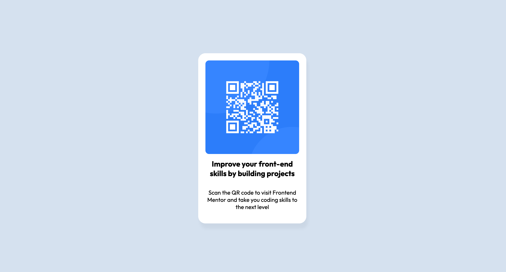

# Frontend Mentors QR Code Project
## Project Description
This is an attempt to build the Frontend Mentors Beginner's project, QR code.  Since this is a beginner's project, it will only use HTML and CSS.  Yet, I'm happy with this basic focus, as I'm mainly looking to improve my understanding of CSS.
## Built With
* HTML
* CSS
## Challenges
Although this project is simple, it did present me with some challenges, as I have not used CSS very much and am still learning it.  Probably the hardest part of this challenge is figuring out how to center all elements.
## What I Learned
The structure of this page was simple, but, to ensure that the colours were consistent with the example provided, I used Krita's Dropper tool to get the RGB values.  I also reinforced some of the different ways that one can center an element on a page, which seemed a lot more difficult before CSS Grid and Flexbox.  Some other techniques that I used were variables in CSS, which is not something that I'd learned before.
## Finished Work
The final project can be found [here](https://grimmaldi.github.io/qr-code-fe-mentors/).  Here is a image of the completed assignment:
